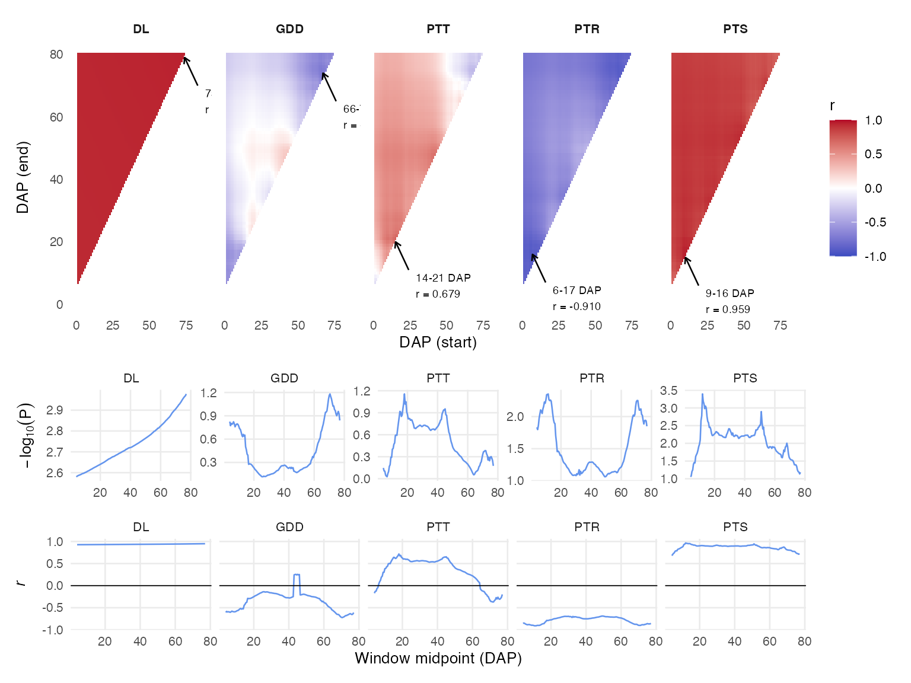
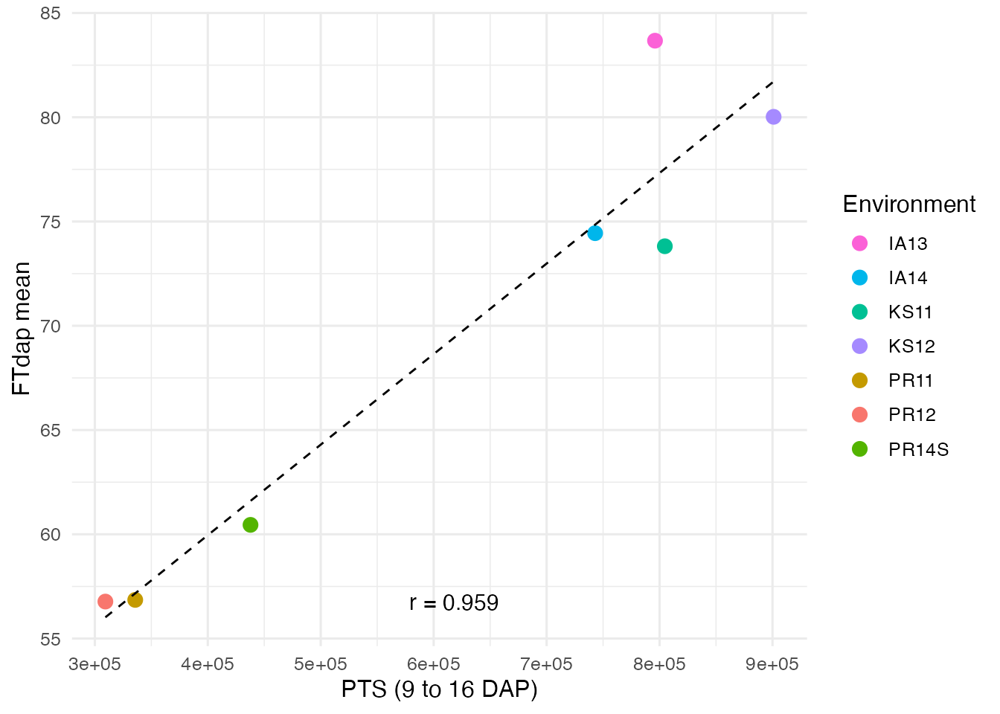
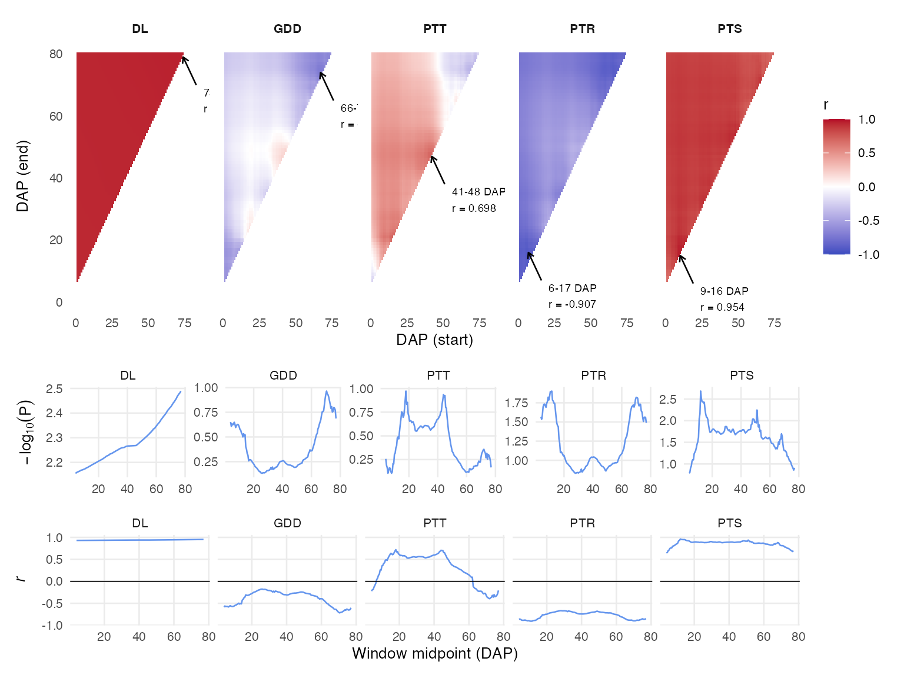

# CERIS Search

This vignette demonstrates the core CERIS analysis: an exhaustive search
over all developmental windows and environmental parameters to identify
the critical period and factor driving GxE variation. We continue with
the sorghum dataset.

``` r

library(runCERIS)

sorghum <- load_crop_data("sorghum")
traits     <- sorghum$traits
env_meta   <- sorghum$env_meta
env_params <- sorghum$env_params

exp_trait      <- prepare_trait_data(traits, trait = "FTdap")
env_mean_trait <- compute_env_means(exp_trait, env_meta)

params <- c("DL", "GDD", "PTT", "PTR", "PTS")
```

## How the Exhaustive Window Search Works

CERIS tests every possible contiguous window of days after planting
(DAP). A window is defined by a start day (`Day_x`) and an end day
(`Day_y`), where `Day_x <= Day_y`. For each window and each
environmental parameter, the algorithm:

1.  Computes a summary statistic (e.g., cumulative sum or mean) of the
    parameter within the window for every environment.
2.  Correlates that summary with the environmental trait mean across
    environments.
3.  Records the Pearson correlation (`R`) and its p-value (`P`).

This nested loop over all (start, end) pairs creates a triangular search
space. The result is a complete map of how the trait–environment
association changes with the developmental window, for every candidate
parameter.

## Running the Search

[`ceris_search()`](../reference/ceris_search.md) performs the exhaustive
search. The `max_days` argument limits the maximum DAP to consider,
which controls both the search space and runtime. Setting
`max_days = 80` is a good starting point for sorghum flowering time:

``` r

ceris_result <- ceris_search(
  env_mean_trait,
  env_params,
  params   = params,
  max_days = 80,
  loo      = FALSE,
  progress = NULL
)
```

The `loo` parameter controls whether leave-one-out cross-validation is
performed (see below). Setting `progress = NULL` suppresses the progress
bar, which is appropriate for non-interactive use.

## Understanding the Output

The result is a data frame with one row per (Day_x, Day_y) combination:

``` r

str(ceris_result)
#> 'data.frame':    2775 obs. of  14 variables:
#>  $ Day_x : num  1 1 1 1 1 1 1 1 1 1 ...
#>  $ Day_y : num  7 8 9 10 11 12 13 14 15 16 ...
#>  $ window: num  6 7 8 9 10 11 12 13 14 15 ...
#>  $ midXY : num  4 4.5 5 5.5 6 6.5 7 7.5 8 8.5 ...
#>  $ R_DL  : num  0.927 0.927 0.928 0.928 0.928 ...
#>  $ R_GDD : num  -0.606 -0.584 -0.582 -0.584 -0.595 ...
#>  $ R_PTT : num  -0.1714 -0.1299 -0.0799 -0.02 0.0064 ...
#>  $ R_PTR : num  -0.853 -0.848 -0.857 -0.871 -0.879 ...
#>  $ R_PTS : num  0.688 0.694 0.73 0.742 0.779 ...
#>  $ P_DL  : num  2.58 2.58 2.58 2.59 2.59 ...
#>  $ P_GDD : num  0.825 0.773 0.768 0.772 0.799 ...
#>  $ P_PTT : num  0.1468 0.1071 0.0631 0.015 0.0047 ...
#>  $ P_PTR : num  1.83 1.8 1.86 1.97 2.04 ...
#>  $ P_PTS : num  1.06 1.08 1.2 1.25 1.41 ...
head(ceris_result)
#>   Day_x Day_y window midXY   R_DL   R_GDD   R_PTT   R_PTR  R_PTS   P_DL  P_GDD
#> 1     1     7      6   4.0 0.9273 -0.6057 -0.1714 -0.8528 0.6876 2.5804 0.8254
#> 2     1     8      7   4.5 0.9275 -0.5840 -0.1299 -0.8479 0.6937 2.5823 0.7731
#> 3     1     9      8   5.0 0.9276 -0.5819 -0.0799 -0.8568 0.7298 2.5848 0.7682
#> 4     1    10      9   5.5 0.9277 -0.5835 -0.0200 -0.8713 0.7415 2.5853 0.7719
#> 5     1    11     10   6.0 0.9278 -0.5951  0.0064 -0.8795 0.7790 2.5877 0.7995
#> 6     1    12     11   6.5 0.9279 -0.5821  0.0352 -0.8784 0.7893 2.5889 0.7687
#>    P_PTT  P_PTR  P_PTS
#> 1 0.1468 1.8321 1.0568
#> 2 0.1071 1.7975 1.0765
#> 3 0.0631 1.8608 1.2034
#> 4 0.0150 1.9732 1.2483
#> 5 0.0047 2.0429 1.4088
#> 6 0.0268 2.0328 1.4581
```

The columns are:

| Column      | Description                                   |
|-------------|-----------------------------------------------|
| `Day_x`     | Start DAP of the window                       |
| `Day_y`     | End DAP of the window                         |
| `window`    | Window length (`Day_y - Day_x + 1`)           |
| `midXY`     | Midpoint of the window                        |
| `R_<param>` | Pearson correlation for each parameter        |
| `P_<param>` | P-value of the correlation for each parameter |

For example, `R_GDD` is the correlation between cumulative GDD within
the window and the trait environmental mean. High absolute correlations
with low p-values indicate that the parameter during that window is a
strong predictor of GxE.

## Identifying the Best Window

[`ceris_identify_best()`](../reference/ceris_identify_best.md) scans the
full search result and identifies the window and parameter with the
strongest association. The `min_window` argument sets a minimum window
length to avoid spuriously narrow windows:

``` r

best <- ceris_identify_best(ceris_result, params = params, min_window = 7)
best
#> $param_name
#> [1] "PTS"
#> 
#> $dap_start
#> [1] 9
#> 
#> $dap_end
#> [1] 16
#> 
#> $correlation
#> [1] 0.9587
#> 
#> $neg_log_p
#> [1] 3.1866
```

The returned list contains the best parameter name, the start and end
DAP of the optimal window, the correlation value, and the negative log
p-value. This is the headline result of the CERIS analysis.

## Visualizing the Search: Heatmap

[`plot_ceris_heatmap()`](../reference/plot_ceris_heatmap.md) displays
the full search result as a set of triangular heatmaps, one per
parameter. The x-axis is the window start day, the y-axis is the window
end day, and the color encodes the correlation strength:

``` r

plot_ceris_heatmap(ceris_result, params = params, max_days = 80)
```



Look for “hot spots” — regions of consistently strong correlation. A
well- defined hot spot indicates a robust critical window. Diffuse
patterns suggest the association is spread across a broader
developmental period.

The plot also includes marginal traces showing how the best correlation
varies with the window start and end days individually.

## Computing Window Parameters

Once you have identified the best window, use
[`compute_window_params()`](../reference/compute_window_params.md) to
calculate the parameter summary for that window in each environment.
This adds a `kPara` column to the environmental means data frame:

``` r

env_mean_enriched <- compute_window_params(
  env_mean_trait,
  env_params,
  dap_start = best$dap_start,
  dap_end   = best$dap_end,
  params    = best$param_name
)
head(env_mean_enriched)
#>   env_code    meanY env_notes     lat      lon PlantingDate TrialYear Location
#> 1     PR12 56.77317         2 18.0373 -66.7963   2011-12-12      2011       PR
#> 2     PR11 56.85371         1 18.0373 -66.7963   2010-12-04      2010       PR
#> 3    PR14S 60.45186         7 18.0373 -66.7963   2014-06-05      2014       PR
#> 4     KS11 73.81378         3 39.1836 -96.5717   2011-06-08      2011       KS
#> 5     IA14 74.44027         6 42.0308 -93.6319   2014-06-10      2014       IA
#> 6     KS12 80.02100         4 39.1836 -96.5717   2012-06-07      2012       KS
#>      kPara
#> 1 309321.4
#> 2 335746.3
#> 3 437819.6
#> 4 804678.1
#> 5 742952.3
#> 6 900995.8
```

The `kPara` column contains the computed value of the best parameter
within the identified window for each environment. This is the
environmental covariate that best predicts the trait variation.

## Correlation Scatter Plot

[`plot_trait_env_param()`](../reference/plot_trait_env_param.md)
visualizes the relationship between the trait environmental mean and the
windowed parameter:

``` r

env_colors <- setNames(
  scales::hue_pal()(nrow(env_mean_trait)),
  env_mean_trait$env_code
)

plot_trait_env_param(
  env_mean_enriched,
  trait      = "FTdap",
  kpara_name = best$param_name,
  dap_start  = best$dap_start,
  dap_end    = best$dap_end,
  env_colors = env_colors
)
```



A tight linear relationship confirms that the identified window and
parameter capture the dominant environmental driver. Points that deviate
from the trend may indicate environments where additional factors are at
play.

## Leave-One-Out Cross-Validation

The standard CERIS search uses all environments to compute correlations.
To assess robustness, you can enable leave-one-out (LOO)
cross-validation by setting `loo = TRUE`. In LOO mode, each environment
is held out in turn and the search is repeated on the remaining
environments. This provides an honest estimate of predictive
performance:

``` r

ceris_loo <- ceris_search(
  env_mean_trait,
  env_params,
  params   = params,
  max_days = 80,
  loo      = TRUE,
  progress = NULL
)
```

The LOO result has the same structure as the standard result. You can
pass it to
[`ceris_identify_best()`](../reference/ceris_identify_best.md) and the
visualization functions in the same way:

``` r

best_loo <- ceris_identify_best(ceris_loo, params = params, min_window = 7)
best_loo
#> $param_name
#> [1] "PTS"
#> 
#> $dap_start
#> [1] 9
#> 
#> $dap_end
#> [1] 16
#> 
#> $correlation
#> [1] 0.9541
#> 
#> $neg_log_p
#> [1] 2.5064
```

If the LOO result agrees with the full-data result (same parameter,
similar window), you can be confident that the finding is robust and not
driven by a single outlier environment.

``` r

plot_ceris_heatmap(ceris_loo, params = params, max_days = 80)
```



## Summary

The CERIS search workflow is:

1.  **Run [`ceris_search()`](../reference/ceris_search.md)** to compute
    correlations for all windows and parameters.
2.  **Use
    [`ceris_identify_best()`](../reference/ceris_identify_best.md)** to
    find the optimal window and parameter.
3.  **Visualize with
    [`plot_ceris_heatmap()`](../reference/plot_ceris_heatmap.md)** to
    inspect the full search landscape.
4.  **Extract the window parameter with
    [`compute_window_params()`](../reference/compute_window_params.md)**
    and plot the trait–parameter relationship with
    [`plot_trait_env_param()`](../reference/plot_trait_env_param.md).
5.  **Validate with LOO** (`loo = TRUE`) to confirm robustness.

This systematic approach turns the complex GxE problem into an
interpretable result: a specific environmental factor, during a specific
developmental window, that explains why genotypes perform differently
across environments.
