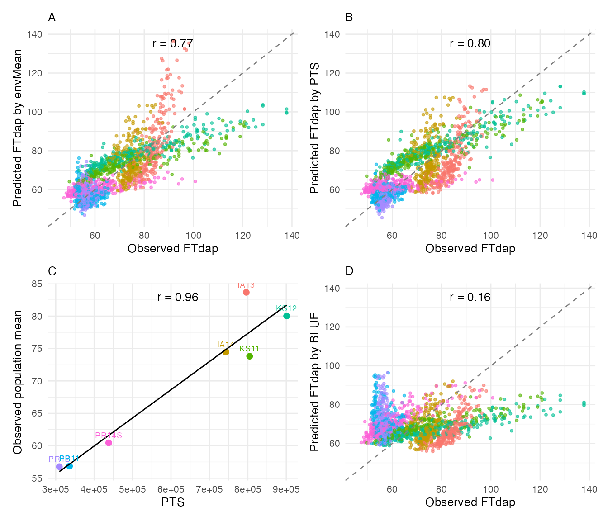
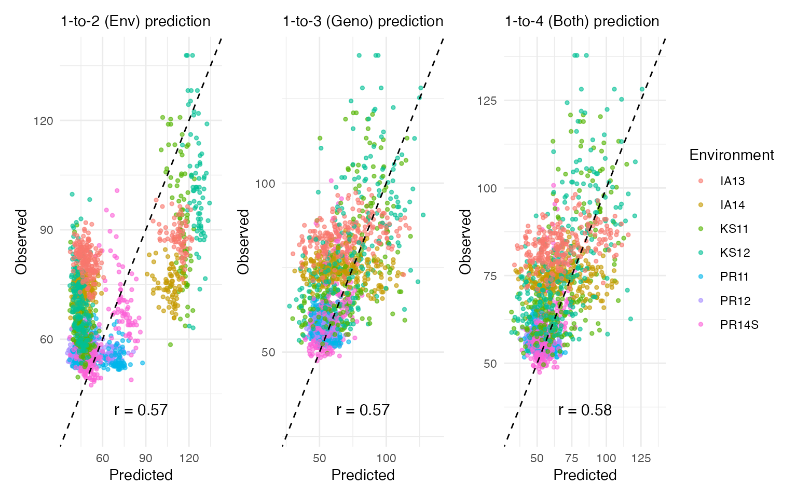

# Cross-Validation

## Overview

Cross-validation (CV) assesses how well a model predicts unseen data.
CERIS provides three CV strategies that differ in what is held out
during prediction:

| Function | Scenario | What is dropped | Use case |
|----|----|----|----|
| [`cv_env()`](../reference/cv_env.md) | 1-to-2 | One environment at a time | Can we predict trait values in a new environment for known genotypes? |
| [`cv_genotype()`](../reference/cv_genotype.md) | 1-to-3 | Genotypes (K-fold) | Can we predict trait values for new genotypes in known environments? Requires marker data. |
| [`cv_combined()`](../reference/cv_combined.md) | 1-to-4 | Both environments and genotypes | Can we predict trait values for new genotypes in new environments? |

In addition, [`loocv()`](../reference/loocv.md) performs line-level
leave-one-out cross-validation, comparing predictions based on the
environmental mean versus the CERIS-derived kPara.

This vignette walks through all four approaches and compares their
predictive accuracy.

## Data Setup

Load the sorghum dataset and run the full CERIS pipeline to obtain the
environmental parameter (kPara):

``` r

library(runCERIS)

d <- load_crop_data("sorghum")

exp_trait <- prepare_trait_data(d$traits, "FTdap")
env_mean_trait <- compute_env_means(exp_trait, d$env_meta)
```

Run the CERIS search with `max_days = 80` for speed, then compute window
parameters:

``` r

ceris_result <- ceris_search(
  env_mean_trait = env_mean_trait,
  env_params     = d$env_params,
  params         = c("DL", "GDD", "PTT", "PTR", "PTS"),
  max_days       = 80,
  loo            = FALSE,
  progress       = NULL
)

best <- ceris_identify_best(ceris_result, params = c("DL", "GDD", "PTT", "PTR", "PTS"))
best
#> $param_name
#> [1] "PTS"
#> 
#> $dap_start
#> [1] 9
#> 
#> $dap_end
#> [1] 16
#> 
#> $correlation
#> [1] 0.9587
#> 
#> $neg_log_p
#> [1] 3.1866

env_mean_trait <- compute_window_params(
  env_mean_trait = env_mean_trait,
  env_params     = d$env_params,
  dap_start      = best$dap_start,
  dap_end        = best$dap_end,
  params         = best$param_name
)
```

## Line-Level Leave-One-Out CV

The [`loocv()`](../reference/loocv.md) function holds out one line at a
time within each environment and predicts its trait value using (a) the
environmental mean and (b) the CERIS-derived kPara regression. This
provides a direct comparison of the two prediction approaches:

``` r

loo_result <- loocv(exp_trait, env_mean_trait)
head(loo_result)
#>   env_code line_code Prd_trait_mean Prd_trait_kPara Obs_trait Line_mean
#> 1     IA13       E10        109.455          94.242   89.7396  78.37150
#> 2     IA14       E10         89.676          91.970   77.3756  80.43217
#> 3     KS11       E10         84.764          93.348   95.5120  77.40943
#> 4     KS12       E10         90.948          97.146  107.9397  75.33815
#> 5     PR11       E10         65.257          62.074   53.4805  84.41468
#> 6     PR12       E10         65.317          59.643   53.1187  84.47498
```

The result contains observed values (`Obs_trait`), predictions from the
environmental mean (`Prd_trait_mean`), predictions from kPara
(`Prd_trait_kPara`), and the genotype’s overall mean (`Line_mean`).

Visualize the prediction accuracy with
[`plot_prediction_result()`](../reference/plot_prediction_result.md):

``` r

plot_prediction_result(
  obs_prd        = loo_result,
  env_mean_trait = env_mean_trait,
  trait          = "FTdap",
  kpara_name     = best$param_name
)
```



This four-panel plot compares observed versus predicted values under
each prediction method, colored by environment. Points closer to the
diagonal indicate better prediction. The kPara-based predictions
typically show tighter clustering around the diagonal when the CERIS
search has identified a strong environmental driver.

## Leave-One-Environment-Out CV

The [`cv_env()`](../reference/cv_env.md) function drops one environment
at a time and predicts trait values for genotypes in that environment
using the remaining environments:

``` r

cv_env_result <- cv_env(env_mean_trait, exp_trait)
head(cv_env_result)
#>   line_code env_code   Yprd    Yobs Rep
#> 1       E10     PR12 69.260 53.1187   1
#> 2      E100     PR12 60.160 60.0257   1
#> 3      E101     PR12 42.997 56.9559   1
#> 4      E102     PR12 42.998 56.5722   1
#> 5      E103     PR12 48.881 53.8861   1
#> 6      E104     PR12 58.647 56.5722   1
```

Each row contains the predicted value (`Yprd`), observed value (`Yobs`),
the held-out environment (`env_code`), and a replicate indicator
(`Rep`). Compute the overall prediction accuracy:

``` r

cor(cv_env_result$Yprd, cv_env_result$Yobs)
#> [1] 0.5689695
```

## K-Fold Genotype CV

The [`cv_genotype()`](../reference/cv_genotype.md) function partitions
genotypes into K folds, holds out each fold in turn, and predicts trait
values for the held-out genotypes using genomic marker data. This
requires:

1.  A slope-intercept matrix (`lm_ab_matrix`) from
    [`slope_intercept()`](../reference/slope_intercept.md) with
    kPara-based coefficients.
2.  A genotype marker matrix (`SNPs`) filtered to lines present in the
    trial.

``` r

lm_ab <- slope_intercept(exp_trait, env_mean_trait, type = "kPara")
SNPs <- prepare_genotype(d$genotype, unique(exp_trait$line_code))
```

Run the K-fold CV with `gFold = 5` and `gIteration = 2` for speed:

``` r

cv_geno_result <- cv_genotype(
  gFold          = 5,
  gIteration     = 2,
  SNPs           = SNPs,
  lm_ab_matrix   = lm_ab,
  env_mean_trait = env_mean_trait,
  exp_trait      = exp_trait,
  progress       = NULL
)
head(cv_geno_result)
#>   line_code env_code   Yprd    Yobs Rep
#> 1      E102     PR12 55.898 56.5722   1
#> 2      E103     PR12 52.691 53.8861   1
#> 3      E107     PR12 52.999 58.1071   1
#> 4      E108     PR12 46.756 60.0257   1
#> 5      E114     PR12 48.203 54.6536   1
#> 6      E119     PR12 57.469 56.5722   1
```

``` r

cor(cv_geno_result$Yprd, cv_geno_result$Yobs)
#> [1] 0.571371
```

## Combined CV

The [`cv_combined()`](../reference/cv_combined.md) function
simultaneously holds out both environments and genotypes, providing the
most stringent test of predictive ability:

``` r

cv_comb_result <- cv_combined(
  gFold          = 5,
  gIteration     = 2,
  SNPs           = SNPs,
  env_mean_trait = env_mean_trait,
  exp_trait      = exp_trait,
  progress       = NULL
)
head(cv_comb_result)
#>   line_code env_code   Yprd    Yobs Rep
#> 1      E103     PR12 53.275 53.8861   1
#> 2      E106     PR12 51.051 57.3396   1
#> 3      E116     PR12 61.195 56.1885   1
#> 4       E12     PR12 56.464 56.1885   1
#> 5      E129     PR12 49.973 56.5722   1
#> 6       E13     PR12 63.522 58.8745   1
```

``` r

cor(cv_comb_result$Yprd, cv_comb_result$Yobs)
#> [1] 0.5712037
```

## Comparing CV Methods

Use [`plot_cv_results()`](../reference/plot_cv_results.md) to display
all three CV methods side by side. The function takes a list of result
data frames and a vector of labels:

``` r

plot_cv_results(
  cv_results = list(cv_env_result, cv_geno_result, cv_comb_result),
  labels     = c("1-to-2 (Env)", "1-to-3 (Geno)", "1-to-4 (Both)")
)
```



Each panel shows observed versus predicted values for one CV method,
with points colored by environment and the correlation coefficient
displayed. Typically, `cv_env` (dropping environments) yields the
highest accuracy because it retains all genotype information, while
`cv_combined` (dropping both) is the most challenging scenario.

## Summary

| CV Method | What is predicted | Marker data needed | Typical accuracy |
|----|----|----|----|
| [`loocv()`](../reference/loocv.md) | One line at a time within each environment | No | Baseline comparison |
| [`cv_env()`](../reference/cv_env.md) | Known genotypes in a new environment | No | Highest |
| [`cv_genotype()`](../reference/cv_genotype.md) | New genotypes in known environments | Yes | Moderate |
| [`cv_combined()`](../reference/cv_combined.md) | New genotypes in new environments | Yes | Lowest |

The gap between `cv_env` and `cv_combined` reflects how much predictive
power comes from knowing the genotype versus knowing the environment.
When the gap is small, the CERIS-derived environmental parameter
captures most of the GxE variation, making environmental
characterization the dominant source of prediction accuracy.
