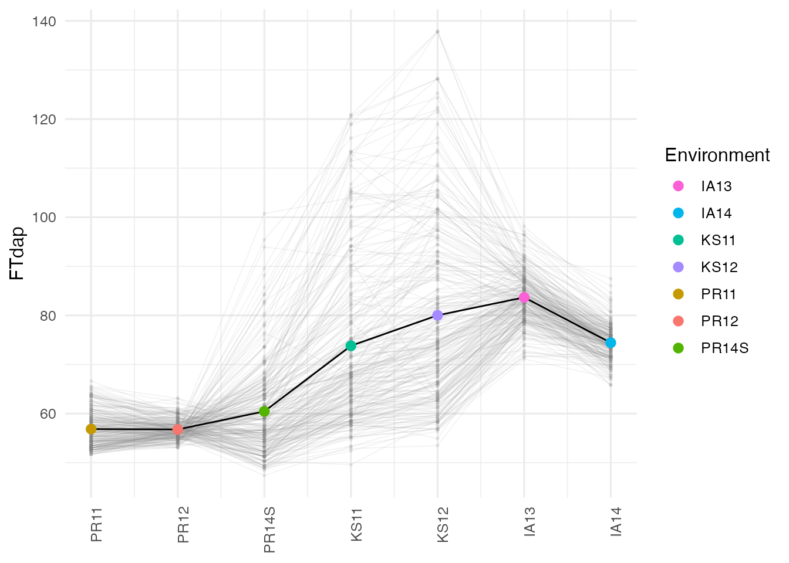
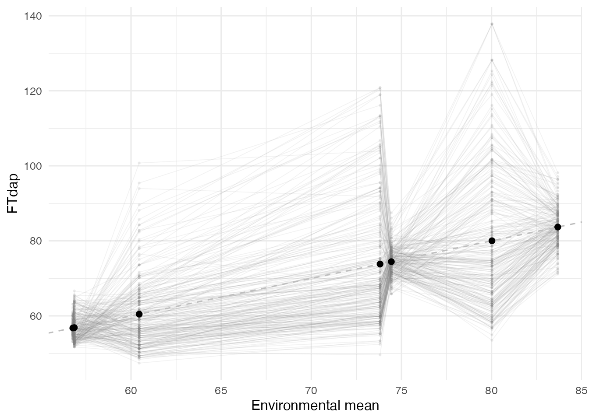
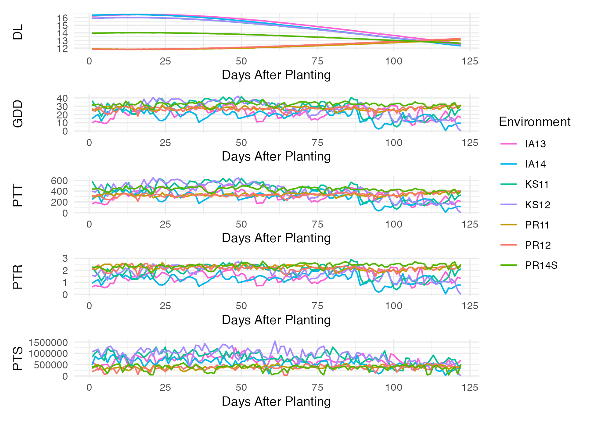
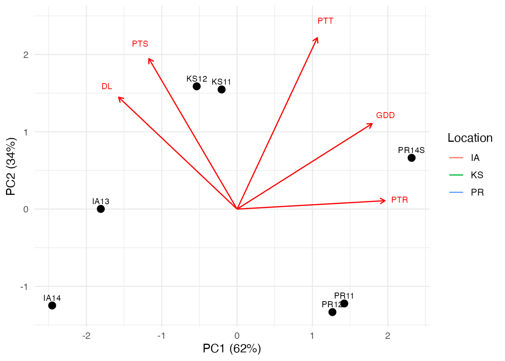
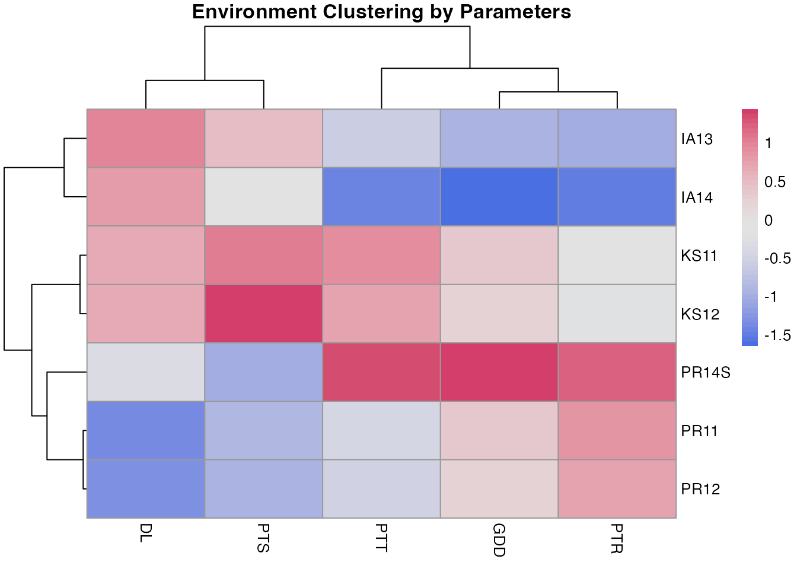

# Data Exploration

This vignette walks through the data preparation and exploratory
visualization steps that precede a CERIS search. We use the built-in
sorghum dataset throughout.

``` r

library(runCERIS)

sorghum <- load_crop_data("sorghum")
traits     <- sorghum$traits
env_meta   <- sorghum$env_meta
env_params <- sorghum$env_params
```

## Preparing Trait Data

Raw trial data typically contains multiple replicates (lines) per
environment.
[`prepare_trait_data()`](../reference/prepare_trait_data.md) averages
across replicates within each environment and returns a tidy data frame
with one row per line per environment:

``` r

exp_trait <- prepare_trait_data(traits, trait = "FTdap")
str(exp_trait)
#> 'data.frame':    1659 obs. of  3 variables:
#>  $ line_code: chr  "E10" "E100" "E101" "E102" ...
#>  $ env_code : chr  "IA13" "IA13" "IA13" "IA13" ...
#>  $ Yobs     : num  89.7 84.3 83.5 78.7 92.4 ...
head(exp_trait)
#>   line_code env_code     Yobs
#> 1       E10     IA13 89.73960
#> 2      E100     IA13 84.28180
#> 3      E101     IA13 83.53581
#> 4      E102     IA13 78.66140
#> 5      E103     IA13 92.39830
#> 6      E104     IA13 87.26640
```

The result has three columns: `line_code`, `env_code`, and `Yobs` (the
observed trait value). This is the starting point for all downstream
analyses.

## Computing Environmental Means

[`compute_env_means()`](../reference/compute_env_means.md) calculates
the mean trait value per environment and merges in the environment
metadata. Environments are ordered by their mean, which reveals the
range of environmental effects:

``` r

env_mean_trait <- compute_env_means(exp_trait, env_meta)
str(env_mean_trait)
#> 'data.frame':    7 obs. of  8 variables:
#>  $ env_code    : chr  "PR12" "PR11" "PR14S" "KS11" ...
#>  $ meanY       : num  56.8 56.9 60.5 73.8 74.4 ...
#>  $ env_notes   : int  2 1 7 3 6 4 5
#>  $ lat         : num  18 18 18 39.2 42 ...
#>  $ lon         : num  -66.8 -66.8 -66.8 -96.6 -93.6 ...
#>  $ PlantingDate: chr  "2011-12-12" "2010-12-04" "2014-06-05" "2011-06-08" ...
#>  $ TrialYear   : int  2011 2010 2014 2011 2014 2012 2013
#>  $ Location    : chr  "PR" "PR" "PR" "KS" ...
env_mean_trait
#>   env_code    meanY env_notes     lat      lon PlantingDate TrialYear Location
#> 1     PR12 56.77317         2 18.0373 -66.7963   2011-12-12      2011       PR
#> 2     PR11 56.85371         1 18.0373 -66.7963   2010-12-04      2010       PR
#> 3    PR14S 60.45186         7 18.0373 -66.7963   2014-06-05      2014       PR
#> 4     KS11 73.81378         3 39.1836 -96.5717   2011-06-08      2011       KS
#> 5     IA14 74.44027         6 42.0308 -93.6319   2014-06-10      2014       IA
#> 6     KS12 80.02100         4 39.1836 -96.5717   2012-06-07      2012       KS
#> 7     IA13 83.67172         5 42.0308 -93.6319   2013-06-05      2013       IA
```

The resulting data frame includes one row per environment with `meanY`
(the environmental mean), plus all columns from `env_meta` (latitude,
longitude, planting date, etc.).

## Wide-Format Line-by-Environment Matrix

For some analyses it is useful to have a wide-format matrix with
genotypes in rows and environments in columns.
[`prepare_line_by_env()`](../reference/prepare_line_by_env.md) creates
this from the prepared trait data and the environmental means:

``` r

line_env <- prepare_line_by_env(exp_trait, env_mean_trait)
head(line_env)
#>   line_code    PR12    PR11   PR14S     KS11    IA14     KS12     IA13
#> 1       E10 53.1187 53.4805 82.8025  95.5120 77.3756 107.9397 89.73960
#> 2      E100 60.0257 66.6417 64.0564  67.8710 77.3756  69.3835 84.28180
#> 3      E101 56.9559 58.7449 65.3437  80.0534 75.4550  87.6977 83.53581
#> 4      E102 56.5722 54.3579 60.0090  72.0880 70.1734  73.2391 78.66140
#> 5      E103 53.8861 54.7966 77.9528 120.8179 77.8557 137.8208 92.39830
#> 6      E104 56.5722 53.4805 64.8587 110.5096 73.5344  95.4089 87.26640
```

Each cell contains the observed trait value for that line in that
environment. The environments (columns) are ordered by their
environmental mean.

## Visualizing Geographic Patterns

[`plot_geo_order()`](../reference/plot_geo_order.md) displays the trait
distribution for each environment, ordered by geographic or
environmental-mean information. This is a useful first look at whether
GxE patterns follow a spatial gradient:

``` r

env_colors <- setNames(
  scales::hue_pal()(nrow(env_mean_trait)),
  env_mean_trait$env_code
)

plot_geo_order(exp_trait, env_mean_trait, trait = "FTdap", env_colors = env_colors)
```



Look for environments that shift in rank relative to others — these
indicate crossover GxE interactions that CERIS is designed to dissect.

## Trait Means Across Environments

[`plot_env_means()`](../reference/plot_env_means.md) shows individual
genotype performance against the environmental mean. Lines that cross
each other indicate rank changes across environments, the hallmark of
GxE:

``` r

plot_env_means(exp_trait, env_mean_trait, trait = "FTdap")
```



A fan-shaped pattern indicates scaling (variance heterogeneity) across
environments. Crossing lines indicate qualitative GxE interactions.

## Daily Environmental Factor Profiles

[`plot_env_factors()`](../reference/plot_env_factors.md) displays the
daily time series of environmental parameters for all environments. This
reveals how conditions diverge across sites and seasons:

``` r

params <- c("DL", "GDD", "PTT", "PTR", "PTS")

plot_env_factors(env_params, params = params, env_colors = env_colors)
```



Each panel shows one parameter over days after planting. Environments
are color-coded. Look for parameters that show clear separation among
environments — these are good candidates for explaining GxE variation.

## PCA Biplot of Environments

[`plot_pca_biplot()`](../reference/plot_pca_biplot.md) performs PCA on
windowed environmental parameters and projects environments into a
reduced space. This gives an overview of how environments cluster based
on their environmental profiles:

``` r

plot_pca_biplot(
  env_params,
  env_mean_trait,
  params    = params,
  group_col = "Location"
)
#> Too few points to calculate an ellipse
#> Too few points to calculate an ellipse
#> Too few points to calculate an ellipse
#> Warning: Removed 3 rows containing missing values or values outside the scale range
#> (`geom_path()`).
```



Environments that are close together in the biplot experienced similar
conditions. The parameter arrows indicate which factors drive the
separation.

## Hierarchical Clustering of Environments

[`plot_clustering_heatmap()`](../reference/plot_clustering_heatmap.md)
provides a complementary view by clustering environments based on their
environmental parameter profiles:

``` r

plot_clustering_heatmap(env_params, params = params, scale_data = TRUE)
```



Scaling is recommended (`scale_data = TRUE`) so that all parameters
contribute equally regardless of their units. The dendrogram on the left
groups similar environments together. Compare these clusters with the
geographic and trait-based groupings to see whether environmental
similarity explains GxE patterns.

## Summary

At this stage you should have a clear picture of:

- The magnitude and pattern of GxE variation in your trait.
- Which environmental parameters vary substantially across environments.
- How environments group geographically, by trait performance, and by
  environmental profiles.

These insights guide interpretation of the CERIS search results. Proceed
to [`vignette("ceris-search")`](../articles/ceris-search.md) to identify
the critical environmental window.
