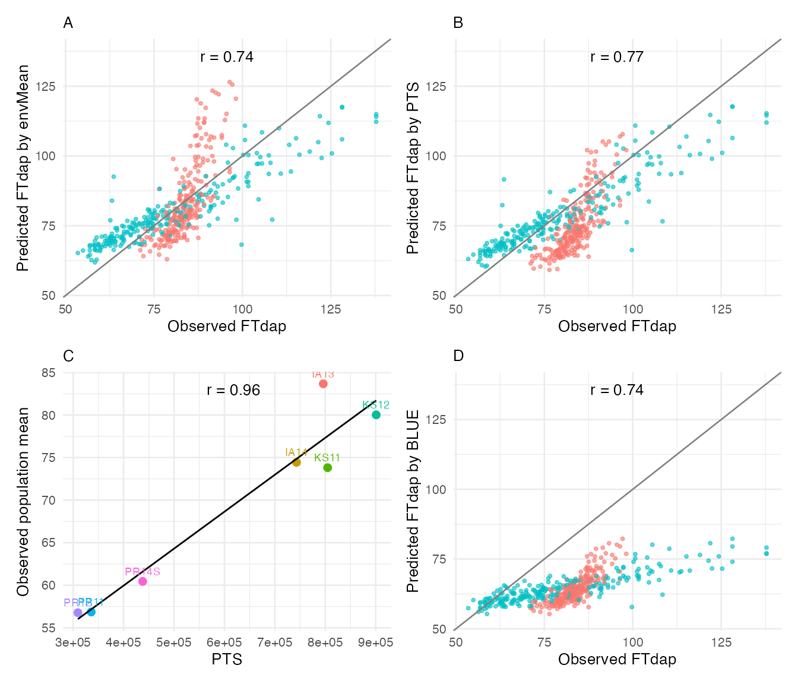

# Genomic Prediction (JGRA)

## Overview

Genomic prediction integrates marker data with environmental covariates
to predict genotype performance in untested environments. CERIS provides
two complementary approaches through the **JGRA** (Joint Genomic
Regression Analysis) framework:

1.  **Reaction norm approach** ([`jgra()`](../reference/jgra.md)):
    Models genotype-by-environment interaction as a function of genomic
    breeding values and their interaction with an environmental
    covariate. The reaction norm captures how each genotype’s
    performance changes along the environmental gradient identified by
    CERIS.

2.  **Marker effect approach**
    ([`jgra_marker()`](../reference/jgra_marker.md)): Estimates
    marker-specific sensitivity to the environmental covariate. Rather
    than summarizing genomic information into a single breeding value,
    this approach models individual marker effects and their
    interactions with the environment.

Both methods leverage the CERIS-identified critical environmental
parameter (kPara) to define the environmental gradient, replacing the
traditional environmental mean with a biologically interpretable
covariate.

This vignette demonstrates how to:

- Prepare the required inputs for JGRA from a standard CERIS pipeline.
- Run genomic prediction using the reaction norm and marker effect
  approaches.
- Evaluate prediction accuracy with different cross-validation schemes.
- Forecast performance in new environments using
  [`forecast_next_year()`](../reference/forecast_next_year.md).

## Data Setup

Load the sorghum dataset and run the standard CERIS pipeline through
[`compute_window_params()`](../reference/compute_window_params.md). This
produces the kPara column needed for JGRA.

``` r

library(runCERIS)

d <- load_crop_data("sorghum")

exp_trait <- prepare_trait_data(d$traits, "FTdap")
env_mean_trait <- compute_env_means(exp_trait, d$env_meta)
```

Run the CERIS exhaustive search to identify the best environmental
window:

``` r

params <- c("DL", "GDD", "PTT", "PTR", "PTS")

ceris_result <- run_CERIS(
  env_mean_trait = env_mean_trait,
  env_params     = d$env_params,
  params         = params,
  max_days       = 80,
  loo            = FALSE,
  progress       = NULL
)

best <- ceris_identify_best(ceris_result, params = params)
best
#> $param_name
#> [1] "PTS"
#> 
#> $dap_start
#> [1] 9
#> 
#> $dap_end
#> [1] 16
#> 
#> $correlation
#> [1] 0.9587
#> 
#> $neg_log_p
#> [1] 3.1866
```

Compute the window-summarized environmental parameter for each
environment:

``` r

env_mean_trait <- compute_window_params(
  env_mean_trait = env_mean_trait,
  env_params     = d$env_params,
  dap_start      = best$dap_start,
  dap_end        = best$dap_end,
  params         = best$param_name
)
head(env_mean_trait)
#>   env_code    meanY env_notes     lat      lon PlantingDate TrialYear Location
#> 1     PR12 56.77317         2 18.0373 -66.7963   2011-12-12      2011       PR
#> 2     PR11 56.85371         1 18.0373 -66.7963   2010-12-04      2010       PR
#> 3    PR14S 60.45186         7 18.0373 -66.7963   2014-06-05      2014       PR
#> 4     KS11 73.81378         3 39.1836 -96.5717   2011-06-08      2011       KS
#> 5     IA14 74.44027         6 42.0308 -93.6319   2014-06-10      2014       IA
#> 6     KS12 80.02100         4 39.1836 -96.5717   2012-06-07      2012       KS
#>      kPara
#> 1 309321.4
#> 2 335746.3
#> 3 437819.6
#> 4 804678.1
#> 5 742952.3
#> 6 900995.8
```

## Preparing JGRA Inputs

The [`jgra()`](../reference/jgra.md) and
[`jgra_marker()`](../reference/jgra_marker.md) functions require three
primary inputs:

- **pheno**: A wide-format data frame with `line_code` in the first
  column and one column per environment containing trait values. This is
  the output of
  [`prepare_line_by_env()`](../reference/prepare_line_by_env.md).
- **geno**: A data frame with `line_code` as the first column followed
  by marker columns. This must be constructed from the genotype matrix.
- **envir**: A data frame with `env_code` and the environmental
  parameter column to use as the covariate.

``` r

# Wide-format phenotype matrix
pheno <- prepare_line_by_env(exp_trait, env_mean_trait)
head(pheno[, 1:4])
#>   line_code    PR12    PR11   PR14S
#> 1       E10 53.1187 53.4805 82.8025
#> 2      E100 60.0257 66.6417 64.0564
#> 3      E101 56.9559 58.7449 65.3437
#> 4      E102 56.5722 54.3579 60.0090
#> 5      E103 53.8861 54.7966 77.9528
#> 6      E104 56.5722 53.4805 64.8587

# Genotype data frame with line_code as first column
geno_df <- data.frame(
  line_code = rownames(d$genotype),
  d$genotype,
  check.names = FALSE
)
geno_df[1:5, 1:5]
#>             line_code E5 E6 E7 E8
#> S1_1857181 S1_1857181  1  1 -1  1
#> S1_1857180 S1_1857180  1  1 -1  1
#> S1_1857182 S1_1857182  1  1 -1  1
#> S1_1857183 S1_1857183  1  1 -1  1
#> S1_1857184 S1_1857184  1  1 -1  1

# Environmental covariate
envir <- env_mean_trait[, c("env_code", "kPara")]
envir
#>   env_code    kPara
#> 1     PR12 309321.4
#> 2     PR11 335746.3
#> 3    PR14S 437819.6
#> 4     KS11 804678.1
#> 5     IA14 742952.3
#> 6     KS12 900995.8
#> 7     IA13 795978.4
```

The `envir` data frame links each environment to its kPara value — the
CERIS-identified environmental covariate summarized over the critical
window. This replaces the traditional environmental mean with a
parameter that has a direct biological interpretation (e.g., cumulative
photoperiod during the sensitive developmental period).

## Reaction Norm Approach

The [`jgra()`](../reference/jgra.md) function fits a reaction norm model
that decomposes genotype performance into a main genetic effect
(breeding value) and a genotype-specific sensitivity to the
environmental covariate. The `method` argument controls the
cross-validation scheme:

- `"RM.E"`: Leave-one-environment-out — predicts performance in
  environments excluded from training.
- `"RM.G"`: K-fold genotype cross-validation — predicts performance of
  genotypes excluded from training.
- `"RM.GE"`: Combined — simultaneously excludes genotypes and
  environments.

We start with environment leave-one-out (`RM.E`), using `fold = 5` and
`reshuffle = 2` for faster computation in this vignette:

``` r

jgra_result <- jgra(
  pheno    = pheno,
  geno     = geno_df,
  envir    = envir,
  enp      = "kPara",
  env_meta = d$env_meta,
  method   = "RM.E",
  fold     = 5,
  reshuffle = 2,
  progress = NULL
)
```

The result contains prediction accuracy metrics:

``` r

# Within-environment correlation
jgra_result$r_within
#>    cor_within envir
#> 1 -0.09051804  PR12
#> 2 -0.20731434  PR11
#> 3  0.84652584 PR14S
#> 4  0.57745974  KS11
#> 5  0.44517081  IA14
#> 6  0.85891930  KS12
#> 7  0.82833064  IA13

# Across-environment correlation
jgra_result$r_across
#> [1] 0.3274092

# Prediction data frame
head(jgra_result$predictions)
#>       obs      pre envir
#> 1 53.1187 72.18935  PR12
#> 2 60.0257 67.23481  PR12
#> 3 56.9559 68.09015  PR12
#> 4 56.5722 62.18671  PR12
#> 5 53.8861 84.15024  PR12
#> 6 56.5722 78.80609  PR12
```

The `r_within` value measures how well the model predicts genotype
rankings within each environment, while `r_across` captures prediction
accuracy across all observations. The `predictions` data frame contains
observed (`obs`) and predicted (`pre`) values along with environment
identifiers.

## Marker Effect Approach

The [`jgra_marker()`](../reference/jgra_marker.md) function uses the
same interface but estimates marker-specific environmental sensitivities
rather than summarizing genomic information into a single breeding
value. This approach can capture more complex patterns of GxE when
individual markers have differential sensitivity to the environmental
covariate:

``` r

marker_result <- jgra_marker(
  pheno    = pheno,
  geno     = geno_df,
  envir    = envir,
  enp      = "kPara",
  env_meta = d$env_meta,
  method   = "RM.E",
  fold     = 5,
  reshuffle = 2,
  progress = NULL
)
```

Compare the marker effect results with the reaction norm approach:

``` r

comparison <- data.frame(
  Method    = c("Reaction Norm (jgra)", "Marker Effects (jgra_marker)"),
  r_within  = c(jgra_result$r_within, marker_result$r_within),
  r_across  = c(jgra_result$r_across, marker_result$r_across)
)
comparison
```

Note: [`jgra_marker()`](../reference/jgra_marker.md) requires datasets
with sufficient genotype matrix dimensions. The sorghum example dataset
is too small for the marker effect method. With larger datasets (e.g.,
hundreds of lines and thousands of markers), both methods run
successfully and can be directly compared.

In many cases the two methods yield similar accuracy for
environment-level prediction (`RM.E`), but the marker effect approach
may outperform the reaction norm model when predicting untested
genotypes (`RM.G` or `RM.GE`), since it models marker-level
heterogeneity in environmental sensitivity.

## Forecasting New Environments

The [`forecast_next_year()`](../reference/forecast_next_year.md)
function provides a direct way to evaluate how well the model predicts
performance in environments excluded from training. This simulates a
practical breeding scenario where historical data from existing trial
sites is used to predict outcomes at new locations or in future years.

We use the first five sorghum environments as training and hold out the
remaining environments as the test set:

``` r

train_envs <- env_mean_trait$env_code[1:5]
test_envs  <- setdiff(env_mean_trait$env_code, train_envs)

cat("Training environments:", paste(train_envs, collapse = ", "), "\n")
#> Training environments: PR12, PR11, PR14S, KS11, IA14
cat("Test environments:    ", paste(test_envs, collapse = ", "), "\n")
#> Test environments:     KS12, IA13

forecast_result <- forecast_next_year(
  exp_trait      = exp_trait,
  env_mean_trait = env_mean_trait,
  trn_env        = train_envs
)
```

Visualize the forecast results with
[`plot_prediction_result()`](../reference/plot_prediction_result.md),
which produces a four-panel display showing observed versus predicted
values, prediction by environment, and the relationship with kPara:

``` r

plot_prediction_result(
  obs_prd        = forecast_result,
  env_mean_trait = env_mean_trait,
  trait          = "FTdap",
  kpara_name     = best$param_name
)
```



The top-left panel shows observed versus predicted trait values colored
by environment. The top-right panel displays predictions against the
environmental mean. The bottom panels show the relationship with the
CERIS-identified environmental parameter. Points close to the diagonal
indicate accurate predictions.

## Choosing the Right Method

The following table summarizes when to use each genomic prediction
approach:

| Scenario | Recommended Method | Rationale |
|----|----|----|
| Predict performance in a new environment (new location or year) | [`jgra()`](../reference/jgra.md) with `method = "RM.E"` | Environment LOO directly evaluates the target scenario. Reaction norm is efficient and interpretable. |
| Predict untested genotypes in known environments | [`jgra_marker()`](../reference/jgra_marker.md) with `method = "RM.G"` | Marker effects capture genotype-specific environmental sensitivity more accurately than a single breeding value. |
| Predict untested genotypes in new environments | [`jgra_marker()`](../reference/jgra_marker.md) with `method = "RM.GE"` | The most challenging scenario benefits from the richer marker-level model. |
| Quick assessment with limited markers | [`jgra()`](../reference/jgra.md) with `method = "RM.E"` | The reaction norm approach is less sensitive to marker density and runs faster. |
| Large marker panels with known QTL | [`jgra_marker()`](../reference/jgra_marker.md) | Marker-specific effects can better leverage known causal variants. |

For all methods, the prediction quality depends critically on the
CERIS-derived kPara providing a meaningful environmental gradient. A
strong CERIS result (high R-squared in the heatmap) translates directly
into better genomic prediction accuracy.

## Alternative GP Method: BayesB

Both [`jgra()`](../reference/jgra.md) and
[`jgra_marker()`](../reference/jgra_marker.md) accept a `gp_method`
parameter to switch between rrBLUP (default, ridge regression BLUP) and
BayesB (Bayesian variable selection via BGLR). BayesB assigns
marker-specific shrinkage, allowing some markers to have large effects
while shrinking others to near zero — useful when the trait architecture
involves few large-effect QTL.

To use BayesB, install the BGLR package and set `gp_method = "BayesB"`:

``` r

# install.packages("BGLR")

jgra_bayesb <- jgra(
  pheno     = pheno,
  geno      = geno_df,
  envir     = envir,
  enp       = "kPara",
  env_meta  = d$env_meta,
  method    = "RM.G",
  gp_method = "BayesB",
  nIter     = 5000,
  burnIn    = 1000,
  seed      = 42,
  fold      = 5,
  reshuffle = 2
)
jgra_bayesb$r_across
```

BayesB is computationally more expensive than rrBLUP due to MCMC
sampling. For exploratory analyses, reduce `nIter` and `burnIn`. For
publication-quality results, use `nIter >= 10000` and `burnIn >= 2000`.

The `seed` parameter ensures reproducible results across runs — this
applies to both BayesB MCMC sampling and the random fold assignments
used in cross-validation.

The same `gp_method` and `seed` parameters are available in
[`cv_genotype()`](../reference/cv_genotype.md) and
[`cv_combined()`](../reference/cv_combined.md):

``` r

cv_result <- cv_genotype(
  gFold = 5, gIteration = 2,
  SNPs = SNPs, lm_ab_matrix = lm_ab,
  env_mean_trait = env_mean_trait, exp_trait = exp_trait,
  gp_method = "BayesB", nIter = 5000, burnIn = 1000, seed = 42
)
```

------------------------------------------------------------------------

## Summary

This vignette demonstrated the two JGRA approaches for genomic
prediction in CERIS:

- **Reaction norm** ([`jgra()`](../reference/jgra.md)): Models breeding
  values and their interaction with kPara. Efficient, interpretable, and
  well-suited for environment-level prediction.
- **Marker effects** ([`jgra_marker()`](../reference/jgra_marker.md)):
  Models individual marker sensitivities to kPara. More flexible for
  genotype-level prediction.
- **Forecasting**
  ([`forecast_next_year()`](../reference/forecast_next_year.md)):
  Evaluates prediction accuracy in a practical train/test split
  scenario.

Both approaches integrate the CERIS-identified critical environmental
window, connecting the environmental search results directly to genomic
prediction. For crops without genotype data, see
[`vignette("multi-crop-examples")`](../articles/multi-crop-examples.md)
for alternative analysis strategies.
