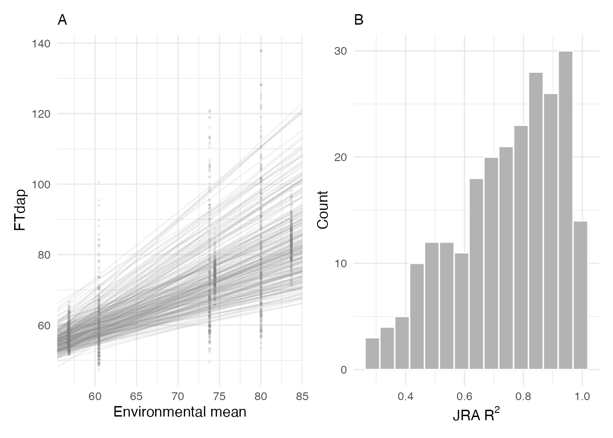

# Joint Regression Analysis

## Overview

**Joint Regression Analysis (JRA)** is a classical method for
characterizing genotype-by-environment (GxE) interaction. Originally
proposed by Finlay and Wilkinson (1963) and refined by Eberhart and
Russell (1966), JRA regresses each genotype’s performance on the
environmental mean. The resulting slope and intercept summarize how each
genotype responds to environmental quality.

### Statistical Model

The observed phenotype of genotype $`i`$ in environment $`j`$ is modeled
as:

``` math
y_{ij} = \alpha_i + \beta_i \, \bar{y}_j + \varepsilon_{ij}
```

where:

- $`y_{ij}`$ is the observed trait value of genotype $`i`$ in
  environment $`j`$
- $`\alpha_i`$ is the intercept (baseline performance) of genotype $`i`$
- $`\beta_i`$ is the regression slope (sensitivity) of genotype $`i`$
- $`\bar{y}_j = \frac{1}{n} \sum_{i=1}^{n} y_{ij}`$ is the environmental
  mean (environmental index)
- $`\varepsilon_{ij}`$ is the residual error

The environmental index $`\bar{y}_j`$ serves as a proxy for overall
environmental quality — higher values indicate more favorable growing
conditions. Each genotype’s slope $`\beta_i`$ quantifies its
responsiveness to environmental variation, while the intercept
$`\alpha_i`$ reflects its general performance level.

CERIS implements JRA through the
[`jra_model()`](../reference/jra_model.md) function. This vignette
demonstrates how to fit the model, visualize the results, and interpret
the output.

## Data Setup

Load the sorghum dataset and prepare the inputs required by
[`jra_model()`](../reference/jra_model.md):

``` r

library(runCERIS)

d <- load_crop_data("sorghum")

exp_trait <- prepare_trait_data(d$traits, "FTdap")
env_mean_trait <- compute_env_means(exp_trait, d$env_meta)
line_by_env <- prepare_line_by_env(exp_trait, env_mean_trait)
```

The `line_by_env` matrix is a wide-format table with genotypes in rows
and environments in columns, containing the observed trait values. This
is the primary input to the JRA model.

``` r

line_by_env[1:5, 1:5]
#>   line_code    PR12    PR11   PR14S     KS11
#> 1       E10 53.1187 53.4805 82.8025  95.5120
#> 2      E100 60.0257 66.6417 64.0564  67.8710
#> 3      E101 56.9559 58.7449 65.3437  80.0534
#> 4      E102 56.5722 54.3579 60.0090  72.0880
#> 5      E103 53.8861 54.7966 77.9528 120.8179
```

## Fitting the JRA Model

The [`jra_model()`](../reference/jra_model.md) function fits a simple
linear regression for each genotype against the environmental means:

``` r

jra_result <- jra_model(line_by_env, env_mean_trait)
head(jra_result)
#>              line_code    Intcp Intcp_mean Slope_mean R2_mean
#> (Intercept)        E10 -24.2110    79.9955     1.5008  0.6681
#> (Intercept)1      E100  29.0797    69.9480     0.5886  0.6418
#> (Intercept)2      E101  -0.7133    72.5409     1.0550  0.9373
#> (Intercept)3      E102   9.2963    66.4430     0.8231  0.9763
#> (Intercept)4      E103 -60.6675    87.9326     2.1402  0.5742
#> (Intercept)5      E104 -26.4641    77.3758     1.4956  0.6291
```

The output data frame contains one row per genotype with the following
columns:

| Column       | Description                                        |
|--------------|----------------------------------------------------|
| `line_code`  | Genotype identifier                                |
| `Intcp`      | Raw intercept from the regression                  |
| `Intcp_mean` | Intercept adjusted to the mean environmental index |
| `Slope_mean` | Slope of the regression on the environmental mean  |
| `R2_mean`    | Coefficient of determination                       |

## Summary Statistics

A quick summary of the slope and R-squared distributions reveals the
overall pattern of GxE interaction in the trial:

``` r

summary(jra_result$Slope_mean)
#>    Min. 1st Qu.  Median    Mean 3rd Qu.    Max. 
#>  0.3552  0.7203  0.9294  1.0000  1.2095  2.2108
summary(jra_result$R2_mean)
#>    Min. 1st Qu.  Median    Mean 3rd Qu.    Max. 
#>  0.2874  0.6173  0.7718  0.7394  0.8893  0.9935
```

The mean slope across all genotypes should be close to 1.0 (by
construction, since the environmental index is the mean across
genotypes). The spread of slopes indicates how much genotypes differ in
their responsiveness.

## Visualization

The [`plot_jra()`](../reference/plot_jra.md) function produces a
two-panel display:

- **Left panel**: Regression lines for all genotypes plotted against the
  environmental mean, with observed data points.
- **Right panel**: Histogram of R-squared values across genotypes.

``` r

plot_jra(exp_trait, env_mean_trait, jra_result, trait = "FTdap")
```



In the left panel, the spread of regression lines shows the degree of
GxE interaction. Parallel lines would indicate no crossover interaction
(genotype rankings remain constant), while crossing lines indicate rank
changes across environments.

The R-squared histogram shows how well the simple linear model fits each
genotype. High R-squared values across most genotypes suggest that a
linear model captures the main pattern of GxE interaction. Genotypes
with low R-squared may exhibit non-linear responses or be influenced by
factors not captured by the environmental mean.

## Interpreting Slopes

The slope from JRA has a direct biological interpretation:

| Slope | Interpretation |
|----|----|
| \> 1 | **Responsive**: The genotype is above average in good environments and below average in poor ones. It exploits favorable conditions but is vulnerable to stress. |
| ~ 1 | **Average**: The genotype tracks the environmental mean proportionally. Its performance mirrors the trial average. |
| \< 1 | **Stable**: The genotype is less affected by environmental variation. It performs relatively better in poor environments but does not fully capitalize on good ones. |

Breeders targeting broad adaptation prefer genotypes with high
intercepts (good overall performance) and slopes near 1. Those targeting
specific environments may select responsive genotypes (slope \> 1) for
favorable conditions or stable genotypes (slope \< 1) for stress-prone
regions.

## Relationship to CERIS

JRA uses the environmental mean as the environmental index, which is a
simple and widely used approach. However, the environmental mean
conflates all sources of environmental variation into a single number.
CERIS improves on this by identifying a specific environmental parameter
and developmental window that best explains GxE variation. The
slope-intercept analysis in
[`vignette("reaction-norms")`](../articles/reaction-norms.md) extends
JRA by using the CERIS-derived kPara as the environmental index, often
yielding higher R-squared values and more biologically interpretable
results.
