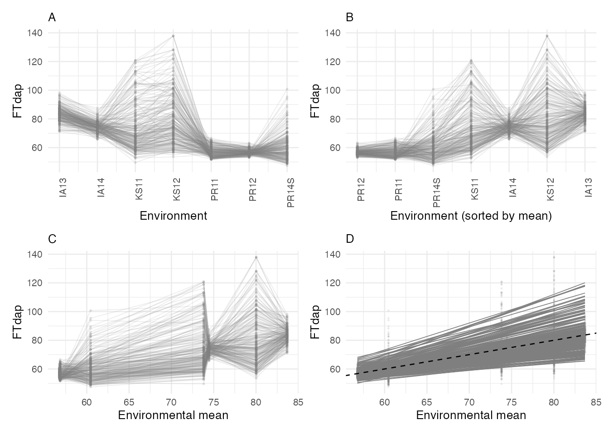
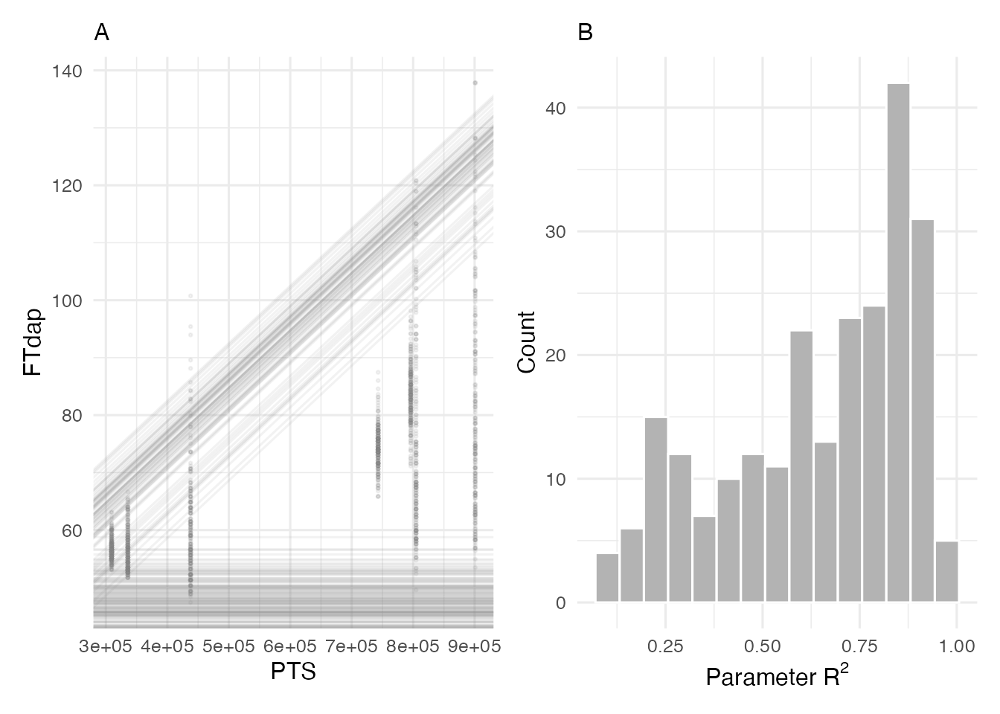
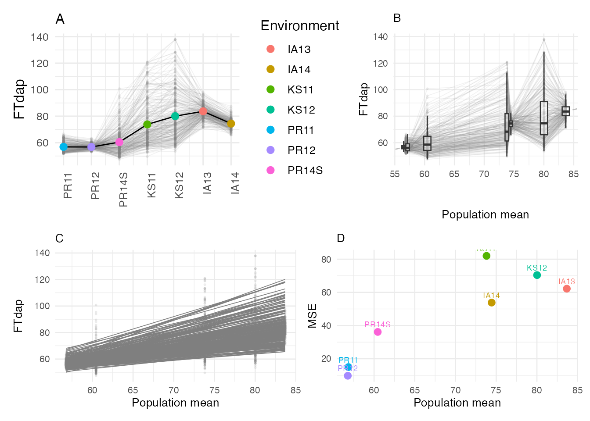

# Reaction Norms and Slope-Intercept Analysis

## Overview

A **reaction norm** describes how a genotype’s phenotype changes across
environments. In the context of multi-environment trials, reaction norms
visualize each genotype’s response as a line plotted against an
environmental index. The classical framework is the Finlay-Wilkinson
regression, where individual genotype performance is regressed on the
environmental mean or on a CERIS-derived environmental parameter
(kPara).

This vignette demonstrates how to:

1.  Compute and visualize reaction norms using both environmental means
    and CERIS-identified parameters.
2.  Extract slope-intercept statistics that characterize genotype
    stability and responsiveness.
3.  Interpret pairwise distance plots for genotype comparison.

## Data Setup

Load the sorghum dataset and prepare the trait data through the full
CERIS pipeline. We use flowering time in days after planting (`FTdap`)
as the trait of interest.

``` r

library(runCERIS)

d <- load_crop_data("sorghum")

exp_trait <- prepare_trait_data(d$traits, "FTdap")
head(exp_trait)
#>   line_code env_code     Yobs
#> 1       E10     IA13 89.73960
#> 2      E100     IA13 84.28180
#> 3      E101     IA13 83.53581
#> 4      E102     IA13 78.66140
#> 5      E103     IA13 92.39830
#> 6      E104     IA13 87.26640
```

Compute environmental means by merging trait averages with environment
metadata:

``` r

env_mean_trait <- compute_env_means(exp_trait, d$env_meta)
head(env_mean_trait)
#>   env_code    meanY env_notes     lat      lon PlantingDate TrialYear Location
#> 1     PR12 56.77317         2 18.0373 -66.7963   2011-12-12      2011       PR
#> 2     PR11 56.85371         1 18.0373 -66.7963   2010-12-04      2010       PR
#> 3    PR14S 60.45186         7 18.0373 -66.7963   2014-06-05      2014       PR
#> 4     KS11 73.81378         3 39.1836 -96.5717   2011-06-08      2011       KS
#> 5     IA14 74.44027         6 42.0308 -93.6319   2014-06-10      2014       IA
#> 6     KS12 80.02100         4 39.1836 -96.5717   2012-06-07      2012       KS
```

Run the CERIS exhaustive search to identify the critical environmental
window. We set `max_days = 80` to keep computation manageable:

``` r

ceris_result <- ceris_search(
  env_mean_trait = env_mean_trait,
  env_params     = d$env_params,
  params         = c("DL", "GDD", "PTT", "PTR", "PTS"),
  max_days       = 80,
  loo            = FALSE,
  progress       = NULL
)
```

Identify the best window and compute the corresponding environmental
parameter (kPara) for each environment:

``` r

best <- ceris_identify_best(ceris_result, params = c("DL", "GDD", "PTT", "PTR", "PTS"))
best
#> $param_name
#> [1] "PTS"
#> 
#> $dap_start
#> [1] 9
#> 
#> $dap_end
#> [1] 16
#> 
#> $correlation
#> [1] 0.9587
#> 
#> $neg_log_p
#> [1] 3.1866

env_mean_trait <- compute_window_params(
  env_mean_trait = env_mean_trait,
  env_params     = d$env_params,
  dap_start      = best$dap_start,
  dap_end        = best$dap_end,
  params         = best$param_name
)
head(env_mean_trait)
#>   env_code    meanY env_notes     lat      lon PlantingDate TrialYear Location
#> 1     PR12 56.77317         2 18.0373 -66.7963   2011-12-12      2011       PR
#> 2     PR11 56.85371         1 18.0373 -66.7963   2010-12-04      2010       PR
#> 3    PR14S 60.45186         7 18.0373 -66.7963   2014-06-05      2014       PR
#> 4     KS11 73.81378         3 39.1836 -96.5717   2011-06-08      2011       KS
#> 5     IA14 74.44027         6 42.0308 -93.6319   2014-06-10      2014       IA
#> 6     KS12 80.02100         4 39.1836 -96.5717   2012-06-07      2012       KS
#>      kPara
#> 1 309321.4
#> 2 335746.3
#> 3 437819.6
#> 4 804678.1
#> 5 742952.3
#> 6 900995.8
```

The `env_mean_trait` data frame now contains a `kPara` column — the
CERIS-identified environmental covariate summarized over the best
window.

## Reaction Norm Plot

The [`plot_reaction_norm()`](../reference/plot_reaction_norm.md)
function produces a four-panel display:

1.  **Top-left**: Reaction norms plotted against the environmental mean
    (meanY).
2.  **Top-right**: Reaction norms plotted against kPara.
3.  **Bottom-left**: Distribution of environmental means.
4.  **Bottom-right**: Distribution of kPara values.

``` r

plot_reaction_norm(exp_trait, env_mean_trait, trait = "FTdap")
```



The top panels show each genotype as a line connecting its observed
values across environments. Steeper lines indicate genotypes that are
more responsive to environmental variation, while flatter lines indicate
more stable genotypes. Comparing the two top panels reveals whether the
CERIS-derived kPara provides a cleaner separation of environments than
the simple mean.

## Slope-Intercept Analysis

The [`slope_intercept()`](../reference/slope_intercept.md) function
regresses each genotype’s observations on either the environmental mean,
the CERIS parameter (kPara), or both. This yields a slope
(responsiveness) and intercept (baseline performance) for each genotype.

### Using kPara

``` r

res_para <- slope_intercept(exp_trait, env_mean_trait, type = "kPara")
head(res_para)
#>   line_code Intcp_para_adj Intcp_para Slope_para R2_para
#> 1       E10        79.9955    34.0257      1e-04  0.7994
#> 2      E100        69.9480    56.5860      0e+00  0.4218
#> 3      E101        72.5409    42.4125      0e+00  0.9748
#> 4      E102        66.4430    44.3077      0e+00  0.9007
#> 5      E103        87.9326    18.6031      1e-04  0.7686
#> 6      E104        77.3758    30.5624      1e-04  0.7862
```

The output contains:

- `Intcp_para_adj`: Intercept adjusted to the mean kPara value.
- `Intcp_para`: Raw intercept from the regression on kPara.
- `Slope_para`: Slope of the regression on kPara.
- `R2_para`: Coefficient of determination for the kPara regression.

### Using Environmental Mean

``` r

res_mean <- slope_intercept(exp_trait, env_mean_trait, type = "mean")
head(res_mean)
#>   line_code Intcp_mean Slope_mean
#> 1       E10    79.9955     1.5008
#> 2      E100    69.9480     0.5886
#> 3      E101    72.5409     1.0550
#> 4      E102    66.4430     0.8231
#> 5      E103    87.9326     2.1402
#> 6      E104    77.3758     1.4956
```

This returns `Intcp_mean` and `Slope_mean` — the classical
Finlay-Wilkinson regression coefficients.

### Both Together

``` r

res_both <- slope_intercept(exp_trait, env_mean_trait, type = "both")
head(res_both)
#>   line_code Intcp_mean Slope_mean Intcp_para_adj Intcp_para Slope_para R2_para
#> 1       E10    79.9955     1.5008        79.9955    34.0257      1e-04  0.7994
#> 2      E100    69.9480     0.5886        69.9480    56.5860      0e+00  0.4218
#> 3      E101    72.5409     1.0550        72.5409    42.4125      0e+00  0.9748
#> 4      E102    66.4430     0.8231        66.4430    44.3077      0e+00  0.9007
#> 5      E103    87.9326     2.1402        87.9326    18.6031      1e-04  0.7686
#> 6      E104    77.3758     1.4956        77.3758    30.5624      1e-04  0.7862
```

Using `type = "both"` returns all columns from both regressions in a
single data frame, which is convenient for comparing the two approaches.

## Slope-Intercept Plot

The [`plot_slope_intercept()`](../reference/plot_slope_intercept.md)
function produces a two-panel display showing the relationship between
intercept (baseline performance) and slope (responsiveness). The first
argument must be the trait data merged with the kPara values from
`env_mean_trait`:

``` r

exp_trait_merged <- merge(
  exp_trait,
  env_mean_trait[, c("env_code", "kPara")],
  by = "env_code"
)

plot_slope_intercept(
  exp_trait_merged = exp_trait_merged,
  res_para         = res_para,
  trait            = "FTdap",
  kpara_name       = best$param_name
)
```



The left panel shows regression lines for each genotype against kPara,
while the right panel displays the slope versus adjusted intercept.
Genotypes in different quadrants have distinct adaptation profiles.

## Pairwise Distance Plot

The [`plot_pairwise_dist()`](../reference/plot_pairwise_dist.md)
function produces a four-panel display that characterizes the pairwise
distances between environments and between genotypes:

``` r

plot_pairwise_dist(exp_trait, env_mean_trait, trait = "FTdap")
```



These panels help identify clusters of similar environments or genotypes
and highlight outliers that behave differently from the rest.

## Interpreting Stability and Responsiveness

The slope from the Finlay-Wilkinson regression (or its CERIS-enhanced
counterpart) is the primary indicator of genotype adaptation:

| Slope | Interpretation |
|----|----|
| \> 1 | **Responsive**: performs disproportionately well in favorable environments but poorly in unfavorable ones. |
| ~ 1 | **Average**: tracks the environmental mean proportionally. |
| \< 1 | **Stable**: less sensitive to environmental variation; maintains more consistent performance. |

A high R-squared value indicates that the environmental index (mean or
kPara) explains most of the genotype’s variation across environments.
Low R-squared suggests that other factors (e.g., biotic stress, soil
heterogeneity) are driving the genotype’s response.

When comparing the mean-based and kPara-based regressions, an
improvement in R-squared with kPara indicates that the CERIS-identified
environmental window captures GxE variation more effectively than the
overall environmental mean.

``` r

summary(res_both$R2_para)
#>    Min. 1st Qu.  Median    Mean 3rd Qu.    Max. 
#>  0.1007  0.4597  0.7189  0.6456  0.8502  0.9748
```

Genotypes with high R-squared under kPara but low R-squared under the
environmental mean are those whose performance is specifically driven by
the critical environmental factor identified by CERIS.
